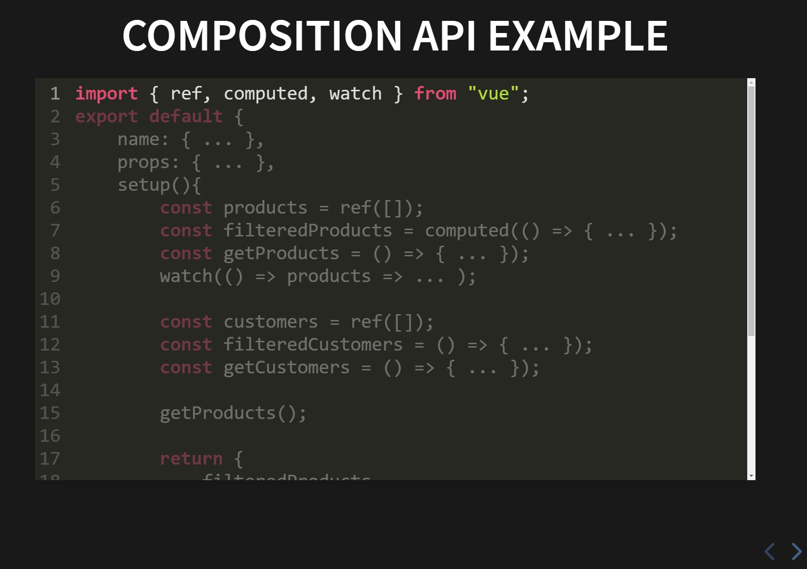

# **Vantea presentation**

It is a presentation of a talk created with JS 📚☝️

## **Table of contents**

- [**Vantea presentation**](#vantea-presentation)
    - [**Table of contents**](#table-of-contents)
    - [**General info**](#general-info)
    - [**Demo**](#demo)
    - [**Screenshots**](#screenshots)
    - [**Technologies**](#technologies)
    - [**Setup**](#setup)
    - [**Usage**](#usage)
    - [**Status**](#status)
    - [**Contact**](#contact)

## **General info**

**Date**: April, 2021  
**Duration**: 2 Days.

We had to make a presentation for a talk about the technologies we are using and it occurred to me to do it with JavaScript instead of using the typical PowerPoint, and together with the **Reveal.js** library and creating small components with **Vue 3** came up 👌.

## **Demo**

You can try it using the [Demo](https://vantea-presentation.netlify.app/)

## **Screenshots**

> <br><i>Contact slide</i>

> <br><i>Composition Api Example slide</i>

## **Technologies**

- [**Reveal JS**](https://revealjs.com/)
- [**Vue 3**](https://v3.vuejs.org/)

## **Setup**

It does not have much complication, the usual flow, download the repository, install dependencies and serve


1. Clone/Download the repository.

```console
git clone https://github.com/udsgit/vantea-presentation
```

2. You may have to install the packages with **NPM**.

```console
npm install
```

3. Serve to local.

```console
npm run serve
```

## **Usage**

1. Open the link from the [Demo](https://vantea-presentation.netlify.app/) or execute the serve with the steps above.
2. Use the navigation arrows to change the slides, Also with "alt + click" you can zoom too. For more shorcuts check reveal.js's doc.

## **Status**

Project is: **_Completed._**

Since it has been exclusively designed to cover a presentation

## **Contact**

Created by [@Emmanuel](https://www.linkedin.com/in/emagleza/), feel free to contact me!
In collaboration by [@Agustin](https://www.linkedin.com/in/agustrocha/).

